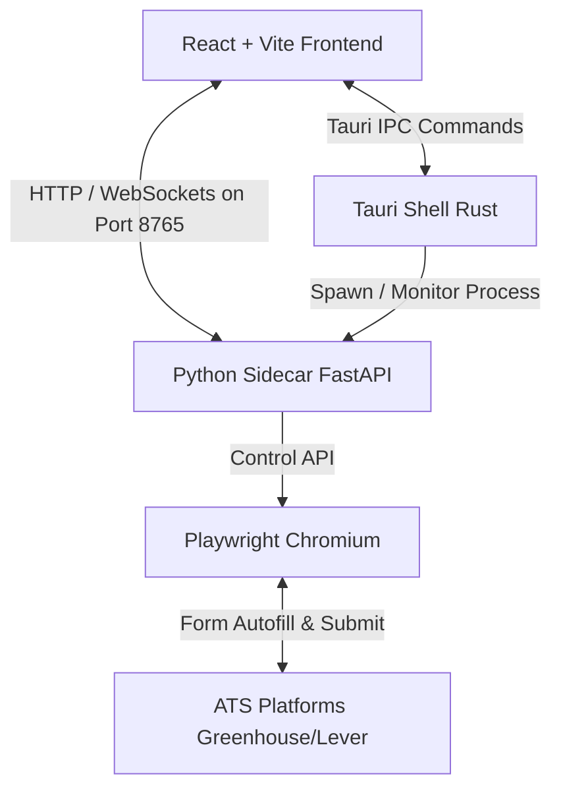
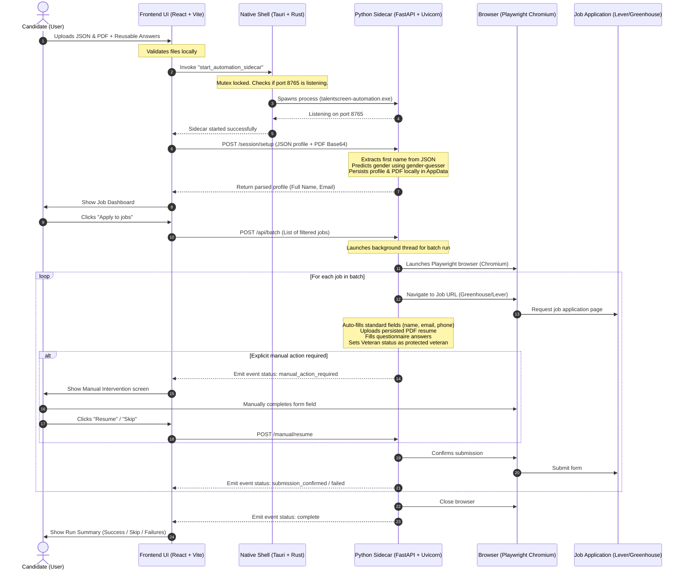

# TalentScreen Apply — Architecture & Internal Workflow

This document provides a detailed breakdown of how the TalentScreen Apply desktop application works internally, describing the sequence of events from when a candidate launches the app to the completion of automated job applications.

---

## 🗺 System Architecture

TalentScreen Apply operates as a hybrid local application consisting of four distinct layers:

1. **Frontend Dashboard (React, Vite, TypeScript):** The user interface running in the Tauri webview. It is responsible for user interaction, uploading profiles, and polling application states.
2. **Native Shell (Tauri & Rust):** A desktop container that manages the application lifecycle, system windowing, IPC commands, and launches/monitors the Python sidecar.
3. **Local Automation Sidecar (FastAPI & Playwright Python):** A frozen Python executable containing a loopback-only API server. It receives inputs, handles profile parsing (like gender detection), and runs browser automation.
4. **Playwright Chromium:** A local web browser managed by Playwright to safely navigate to, autofill, and submit job applications.

---

## 🔄 Internal Workflow Sequence

The diagram below details the entire sequence of data exchange and lifecycle events:

---

## 🔍 Internal Operations & Logic Details

### 1. Zero-Race Sidecar Launch
When the frontend commands Tauri to start the sidecar:
- A Rust-level **Mutex** locks the spawn event.
- Tauri checks if port `8765` is already active to prevent duplicates.
- If inactive, it spawns `talentscreen-automation.exe` and maps stdio to `%APPDATA%\.talentscreen_resume\sidecar.log`.
- The frontend polls `/status` with a timeout until the sidecar responds.

### 2. Profile Normalization & Demographic Mapping
During the `/session/setup` phase, the sidecar maps and persists data:
* **Persisted Paths:** Persists configuration to `%APPDATA%\.talentscreen_resume\profile.json` and the resume to `resume.pdf`.
* **Gender Inference:** Pulls the first name from the profile and infers gender (Male/Female) using a localized database of names via `gender-guesser`. It runs instantly without any slow natural language processing (NLP) models.
* **Protected Veteran Selection:** The autofill logic **always** checks and selects the protected veteran classification option (e.g., "I identify as one or more classifications of a protected veteran") to comply with candidate configurations.
* **Demographics (Race/Disability):** Defaults to standard "Decline to Self Identify" / "No, I don't have a disability" unless custom answer overrides are detected in the uploaded profile.

### 3. Playwright Automation Batching
Once the application batch starts:
* The FastAPI sidecar spins up a detached background thread to execute the batch runs so that the API remains responsive.
* The frontend polls `/events?cursor=X` every `700ms` to update progress indicators (Vitals, logs, and success states) in real-time.
* If a captcha, custom questions, or multi-factor inputs are encountered, Playwright pauses the script, raises a `manual_action_required` state, and waits until the user finishes inputting before continuing.

---

## 🛡 Security & Privacy Model

* **100% Local Run:** All communications between Tauri and FastAPI happen over loopback network interfaces (`127.0.0.1`). No external servers receive your profile or PDF.
* **No Database/Cloud Storage:** Your details exist purely in your local filesystem.
* **No LLMs Used:** The automation fills forms deterministically using rule-based parsing and selectors, guaranteeing no AI hallucinations or fake inputs are submitted.
